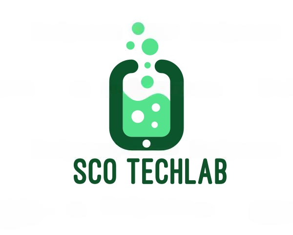

  

## Node Multer Files
Node multer files is a easy files management for Node, you can install and use it in Express or NestJS too.
Node multer files is full asynchronus to make easier the files management in the server side.

### Get Started
- Install dependency
<pre>
npm i @sco-techlab/node-multer-files
</pre>
- Import in your application
<pre>
import * as easyfiles from '@sco-techlab/node-multer-files';
</pre>

### Export interfaces
- IMulterFile
<pre>
export interface IMulterFile {
    fieldname: string;
    originalname: string;
    encoding: string;
    mimetype: string;
    size: number;
    destination: string;
    filename: string;
    path: string;
    buffer: Buffer;
    stream: stream.Readable;
}
</pre>
- IFileObjectOptions
<pre>
export interface IFileObjectOptions {
    fieldname?: string;
    encoding?: string;
    mimetype?: string;
    stream?: boolean;
}
</pre>

### Export methods
- fileObject
<pre>fileObject = async ( file: string, options: IFileObjectOptions = {} ): Promise&lt;IMulterFile&gt;</pre>

- dataUrl
<pre>dataUrl = async ( file: IMulterFile | string): Promise&lt;unknown&gt;</pre>

- base64
<pre>base64 = async ( file: IMulterFile | string ): Promise&lt;string&gt;</pre>

- mimeType
<pre>mimeType = async ( file: IMulterFile | string ): Promise&lt;string&gt;</pre>

- exists
<pre>exists = async ( file: IMulterFile | string ): Promise&lt;boolean&gt;</pre>

- isDirectory
<pre>isDirectory = async (file: IMulterFile | string): Promise&lt;boolean&gt;</pre>

- save
<pre>save = async ( file: IMulterFile | string, destination: string, new_name: string = undefined ): Promise&lt;boolean&gt;</pre>

- remove
<pre>remove = async ( file: IMulterFile | string ): Promise&lt;boolean&gt;</pre>

- write
<pre>write = async (file: IMulterFile | string, value: string = undefined): Promise&lt;boolean&gt;</pre>

- append
<pre>append = async (file: IMulterFile | string, value: string = undefined): Promise&lt;boolean&gt;</pre>

- read
<pre>read = async (file: IMulterFile | string): Promise&lt;Buffer&gt;</pre>

## Author
Santiago Comeras Oteo
- <a href="https://web.sco-techlab.es/">SCO Techlab</a>
- <a href="https://github.com/SCO-Techlab">GitHub</a>
- <a href="https://www.npmjs.com/settings/sco-techlab/packages">Npm</a>
- <a href="https://www.linkedin.com/in/santiago-comeras-oteo-4646191b3/">LinkedIn</a>  

  

